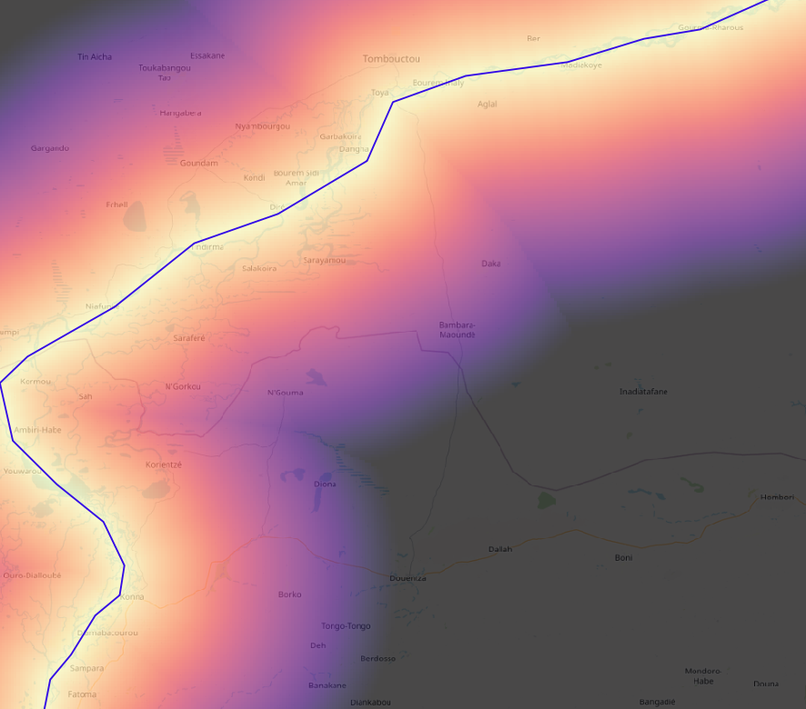

# distance-rasters

Generate distance raster using arbitrary sets of spatial features

[](https://github.com/sgoodm/python-distance-rasters/actions/workflows/test-and-coverage.yml)
[](https://coveralls.io/github/sgoodm/python-distance-rasters)
[](https://pepy.tech/project/distancerasters)


More in depth description and context. Guidelines for use and tips.


## Example

The below example calculates the distance to a rough approximation of a section of the Niger river in Mali. See the `examples` folder for the code and data.

```
import fiona
import distancerasters as dr


# load vector data (crs = epsg:4326)
shp = fiona.open("examples/linestrings.geojson", "r")

# resolution (in units matching projection) at which vector data will be rasterized
pixel_size = 0.01


# rasterize vector data and output to geotiff
rv_array, affine = dr.rasterize(shp, pixel_size=pixel_size, bounds=shp.bounds, output="examples/linestrings_rasterized_binary.tif")

# option to manually export rasterized vector data
# dr.export_raster(rv_array, affine, "linestrings_rasterized_binary.tif")

# function to define which cells from rasterized input to calculate distance to
#   this would be modified if using a non-binary rasterization, for example
def raster_conditional(rarray):
    return (rarray == 1)

# generate distance array and output to geotiff
dist_array = dr.build_distance_array(rv_array, affine=affine,
                     output="examples/linestrings_distance_raster.tif",
                     conditional=raster_conditional)

# Output:
#
# Tree build time: 0.033019065856933594 seconds
# Building distance array...
# Total run time: 2.88 seconds
```

The resulting distance raster indicates the distance to the line segment. In the image below, areas close to the line segment (in dark blue) are yellow and get darker the further away you go.




## Installation


### Using pip

The latest version of distance-rasters is [available on PyPi](https://pypi.org/project/distancerasters/), so you can install it with pip:
```
pip install distancerasters
```

If you'd like to install the latest development (alpha) release, there may be a newer version on [TestPyPi](https://test.pypi.org/project/distancerasters/):
```
pip install -i https://test.pypi.org/simple/ distancerasters
```

### From source

To install this package from source, first clone this repository, then use pip to install it:
```
git clone git@github.com:sgoodm/python-distance-rasters.git
cd python-distance-rasters
pip install .
```


## Contribute

New issues are always welcome, and if you'd like to make a change, fork the repo and submit a pull request.


### Testing and Coverage

We use Pytest and Coveralls to run unit tests and track code coverage of tests. If you submit code, please make sure it passes existing tests and adds relevant testing coverage for new features.

You can run tests and coverage checks locally, or you can fork the repository and utilize GitHub actions and Coveralls. To use GitHub actions and Coveralls, you'll need to add your forked repo to your Coverall accounts and add the repository's token to your repository as a GitHub Secret (see below).


To run tests and coverage checks locally, you can use the following commands:
```
pip install pytest coverage shapely geopandas
coverage run -m pytest ./
coverage html
```

### GitHub Secrets

In a cloned repository, there are three GitHub Secrets required to enable all of our GitHub Actions:
1. COVERALLS_REPO_TOKEN - this is the API token for Coveralls, used for publishing code coverage reports
2. TEST_PYPI_API_TOKEN - this is the API token for TestPyPi, needed for publishing alpha releases
3. PYPI_API_TOKEN - this is the API token for PyPi, needed for publishing releases

Note: contributors do not need PyPi tokens; if you create a new release in a forked repo it will trigger a GitHub action that will attempt to publish to PyPi and fail.